# baseball-score-kata

A 45-60 minute Kata focused on Test-Driven Development (TDD) and designed to improve skills on getting results even when domain knowledge is limited. 

## Intro
You are about to implement a baseball play-by-play score tracker.

API contains 2 functions:
* _play(event: Play)_ - accepts one of the possible events that change the game state.
* _score(): [Int, Int]_ - returns a pair of integers as a current score.

## Running tests
Kotlin project:
```shell
./gradlew test
```

Typescript project:
```shell
yarn jest
```

## Baseball rules
This Kata doesn't expect you to understand baseball rules and intentionally simplifies a lot of the original baseball terminology.
For example, a **player** here would usually be called a **batter** or **hitter** in a real game, and **score** is used interchangeably with **run**, while **half-inning** is referred to as **game interval**.

Avoid delving too deeply into a detailed understanding of the real game, as it might divert your focus from a pragmatic implementation.


Yet, there are some basics that help provide a general understanding:

* A baseball game is a competition between two teams.
* It consists of intervals during which one team attacks, and the other defends. Once the interval is over, the teams switch roles.
* The playing field is represented by a square where each corner is a base.
* Players of an attacking team (base-runners) move in a counter-clockwise direction, advancing base by base.
* The base-runner who manages to complete a full circle earns one point for the team and celebrates.

## Plays
There are 9 type of plays that can happen in any order. The total sequence of plays defines the score.
### OUT
The player is out (before they started running)

3 OUTs = end of the interval. Teams switch roles. Base-runners leave their positions.

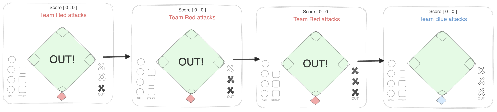

### STRIKE
Doesn't affect anything as a single event. but 3 STRIKEs = OUT

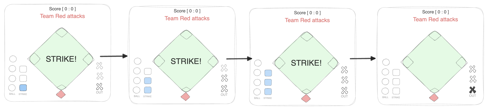

> Strike Counter resets for every new player entering the game.


### BALL
Doesn't affect anything as a single event. But 4 balls = player became runner and walks to 1st base.

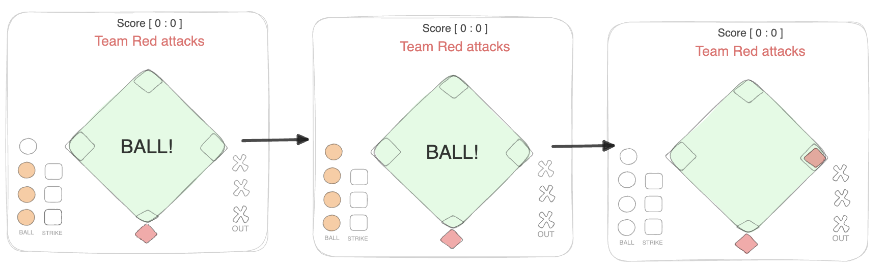

_If there is another runner already on 1st base, it moves to the 2nd. If there is yet another runner already on 2nd, it moves to the 3rd, and so on and so forth._

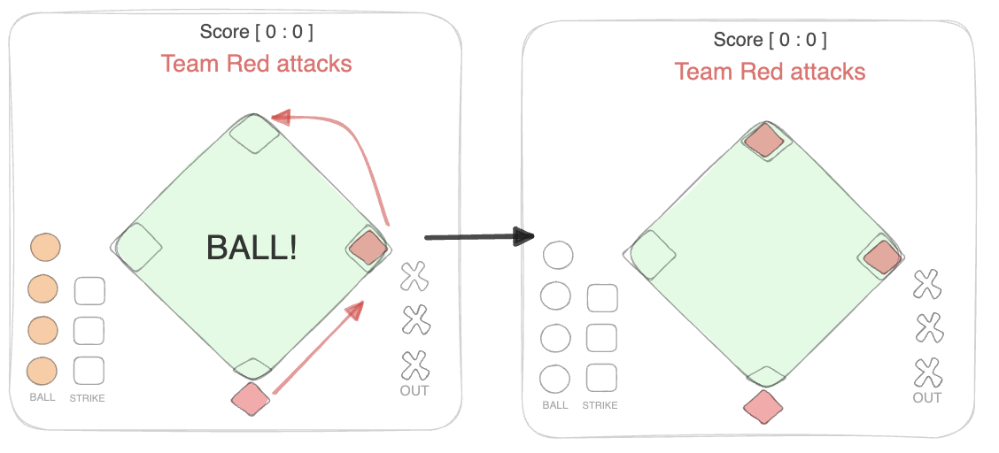

_If the 1st base is empty player just takes it. No other runners advance._

> Ball counter resets for every new player entering the game.

### SINGLE
Successful player action. Player takes 1st base. All runners advance +1 base

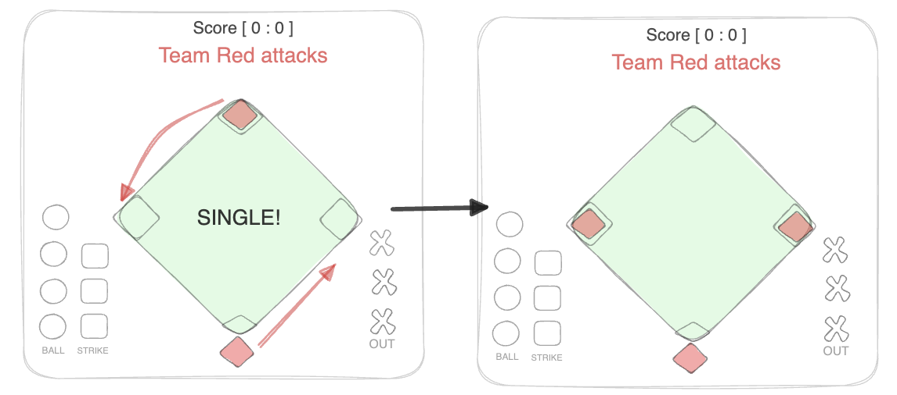

### DOUBLE
Successful player action. Player takes 2nd base. All runners advance +2 bases

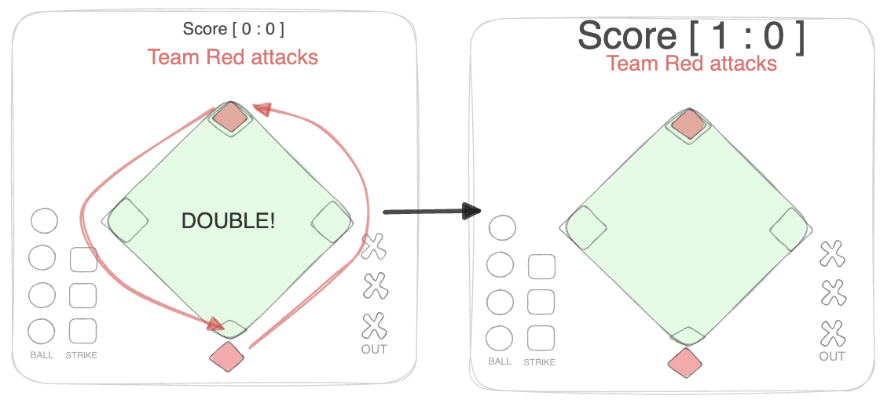


### TRIPLE
Successful player action. Player takes 3rd base. In fact all runners score.

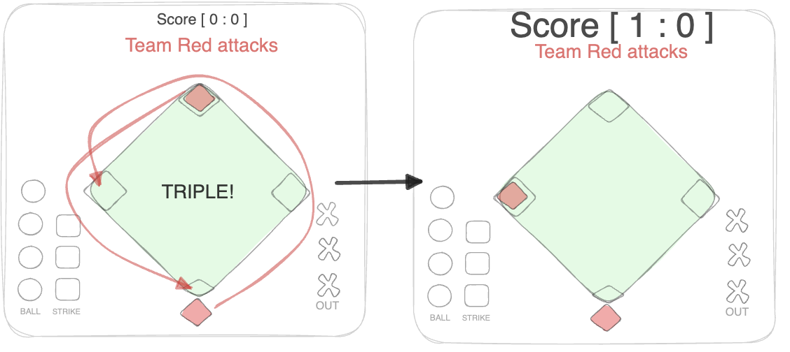

### HOMERUN
Successful player action. Player scores. All runners score.

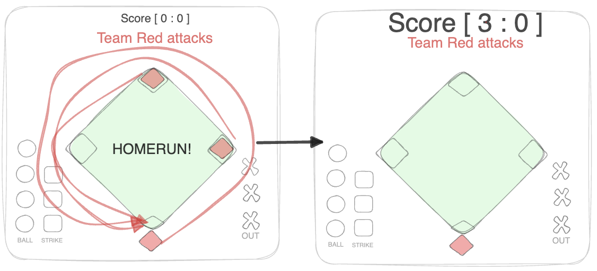

### STEAL
Successful runner action. The leading runner advances +1 base.

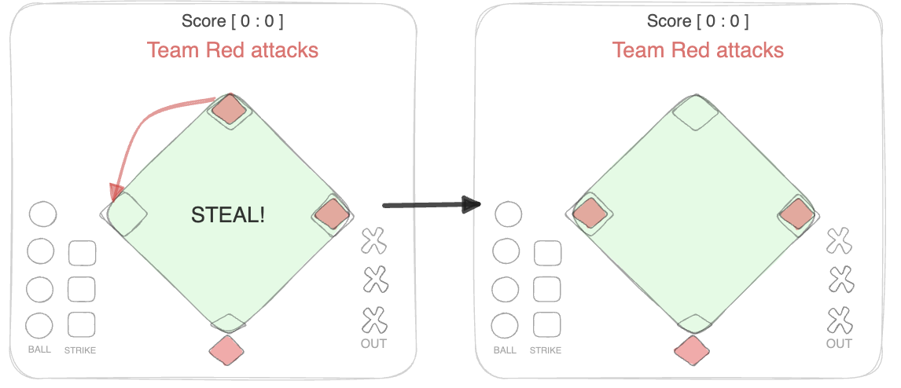

_Stealing the home = score_
> When bases are empty the play should be ignored.
  
 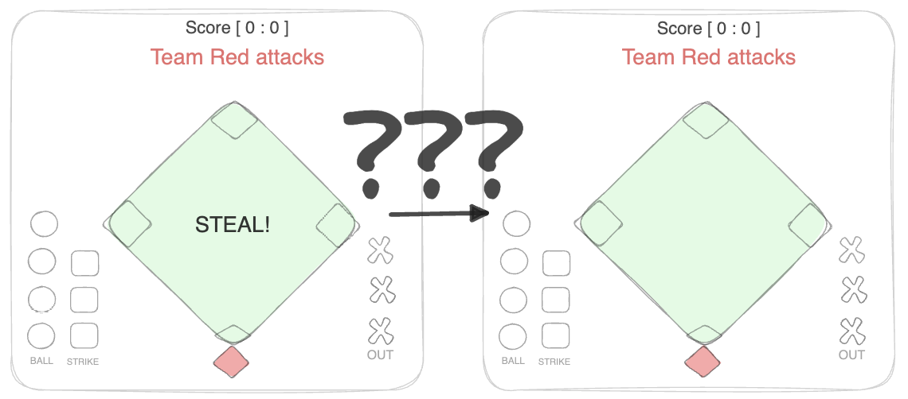

### SACRIFICE_OUT
Player is out but all runners advance +1 base.


> If a team already has 2 outs SACRIFICE_OUT means simply OUT. No score.

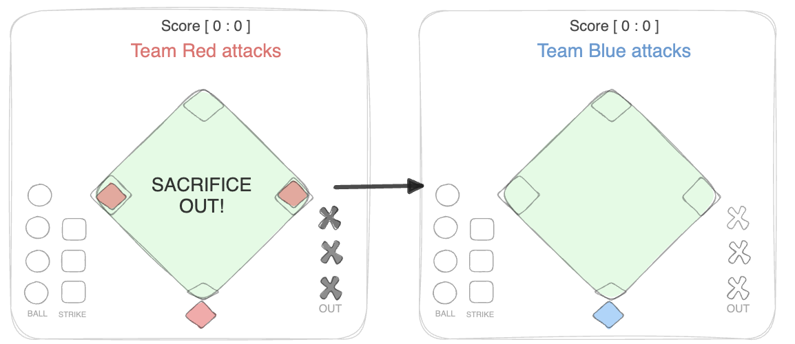
